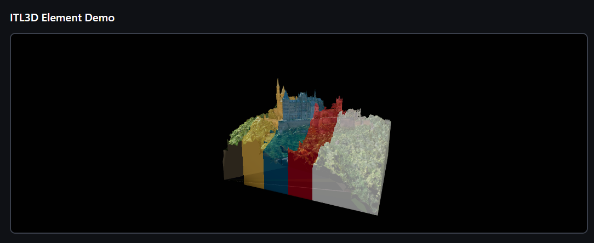

# ITL3D - React 3D Component Library

一个基于 React Three Fiber 的 3D 模型展示和切割组件库。

> ⚠️ **注意**：这是一个私有包，不发布到公共 npm 仓库。请参考 [PRIVATE_PACKAGE_USAGE.md](./PRIVATE_PACKAGE_USAGE.md) 了解如何在其他项目中使用。


## 📦 安装（私有使用）

详见 [PRIVATE_PACKAGE_USAGE.md](./PRIVATE_PACKAGE_USAGE.md)

## 🚀 快速开始

```tsx
import { ITL3D } from 'itl3d'

function App() {
  return (
    <div style={{ width: '800px', height: '600px' }}>
      <ITL3D
        modelUrl="/your-model.glb"
        mode="cutBody"
        cutDepth={35}
        cutAngle={0}
        canRotate={true}
      />
    </div>
  )
}
```

## 🛠️ 开发

### 本地开发

```bash
# 安装依赖
npm install

# 启动开发服务器
npm run dev

# 构建库
npm run build:lib

# 预览构建结果
npm run preview
```

### 在其他项目中使用

详见 [PRIVATE_PACKAGE_USAGE.md](./PRIVATE_PACKAGE_USAGE.md)

## 📝 组件文档

详细的组件 API 文档请查看 [component/README.md](./component/README.md)

## 👥 团队协作使用

这是一个私有包，不发布到公共 npm。团队成员可以通过以下方式使用：

### 推荐方式：Git 仓库

1. **将代码推送到 Git 仓库**（GitHub、GitLab、Gitee 等）
2. **团队成员安装**：
   ```bash
   npm install git+https://github.com/your-username/itl3d.git
   ```
3. **在代码中使用**：
   ```tsx
   import { ITL3D } from 'itl3d'
   ```

详见 [TEAM_USAGE_GUIDE.md](./TEAM_USAGE_GUIDE.md) 了解所有使用方式。

## 📄 License

MIT
